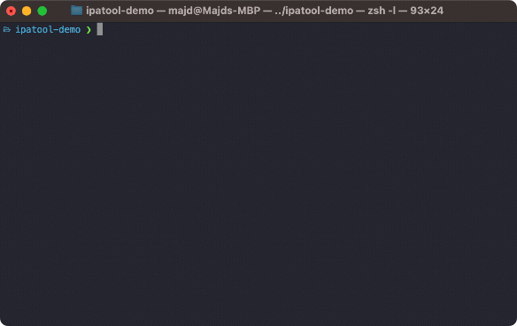

# IPATool

[](https://GitHub.com/majd/ipatool/releases/)
[](https://github.com/majd/ipatool/blob/main/LICENSE)

`ipatool` is a command line tool that allows you to search for iOS apps on the [App Store](https://apps.apple.com) and download a copy of the app package, known as an _ipa_ file.



- [Requirements](#requirements)
- [Installation](#installation)
  - [Manual](#manual)
  - [Package Manager (macOS)](#package-manager-macos)
- [Usage](#usage)
- [Compiling](#compiling)
- [License](#license)
- [Releases](https://github.com/majd/ipatool/releases)
- [FAQ](https://github.com/majd/ipatool/wiki/FAQ)

## Requirements

- Supported operating system (Windows, Linux or macOS).
- Apple ID set up to use the App Store.

## Installation

### Manual

You can grab the latest version of `ipatool` from [GitHub releases](https://github.com/majd/ipatool/releases).

### Package Manager (macOS)

You can install `ipatool` using [Homebrew](https://brew.sh).

```shell
$ brew install ipatool
```

## Usage

To authenticate with the App Store, use the `auth` command.

```
Authenticate with the App Store

Usage:
  ipatool auth [command]

Available Commands:
  info        Show current account info
  login       Login to the App Store
  revoke      Revoke your App Store credentials

Flags:
  -h, --help   help for auth

Global Flags:
      --format format     sets output format for command; can be 'text', 'json' (default text)
      --non-interactive   run in non-interactive session
      --verbose           enables verbose logs

Use "ipatool auth [command] --help" for more information about a command.
```

To search for apps on the App Store, use the `search` command.

```
Search for iOS apps available on the App Store

Usage:
  ipatool search <term> [flags]

Flags:
  -h, --help        help for search
  -l, --limit int   maximum amount of search results to retrieve (default 5)

Global Flags:
      --format format     sets output format for command; can be 'text', 'json' (default text)
      --non-interactive   run in non-interactive session
      --verbose           enables verbose logs
```

To obtain a license for an app, use the `purchase` command.

```
Obtain a license for the app from the App Store

Usage:
  ipatool purchase [flags]

Flags:
  -b, --bundle-identifier string   Bundle identifier of the target iOS app (required)
  -h, --help                       help for purchase

Global Flags:
      --format format     sets output format for command; can be 'text', 'json' (default text)
      --non-interactive   run in non-interactive session
      --verbose           enables verbose logs
```

To obtain a list of availble app versions to download, use the `list-versions` command.

```
List the available versions of an iOS app

Usage:
  ipatool list-versions [flags]

Flags:
  -i, --app-id int                 ID of the target iOS app (required)
  -b, --bundle-identifier string   The bundle identifier of the target iOS app (overrides the app ID)
  -h, --help                       help for list-versions

Global Flags:
      --format format                sets output format for command; can be 'text', 'json' (default text)
      --keychain-passphrase string   passphrase for unlocking keychain
      --non-interactive              run in non-interactive session
      --verbose                      enables verbose logs
```

To download a copy of the ipa file, use the `download` command.

```
Download (encrypted) iOS app packages from the App Store

Usage:
  ipatool download [flags]

Flags:
  -i, --app-id int                   ID of the target iOS app (required)
  -b, --bundle-identifier string     The bundle identifier of the target iOS app (overrides the app ID)
      --external-version-id string   External version identifier of the target iOS app (defaults to latest version when not specified)
  -h, --help                         help for download
  -o, --output string                The destination path of the downloaded app package
      --purchase                     Obtain a license for the app if needed

Global Flags:
      --format format                sets output format for command; can be 'text', 'json' (default text)
      --keychain-passphrase string   passphrase for unlocking keychain
      --non-interactive              run in non-interactive session
      --verbose                      enables verbose logs
```

To resolve an external version identifier, returned by the `list-versions` command, use the `get-version-metadata` command.

```
Retrieves the metadata for a specific version of an app

Usage:
  ipatool get-version-metadata [flags]

Flags:
  -i, --app-id int                   ID of the target iOS app (required)
  -b, --bundle-identifier string     The bundle identifier of the target iOS app (overrides the app ID)
      --external-version-id string   External version identifier of the target iOS app (required)
  -h, --help                         help for get-version-metadata

Global Flags:
      --format format                sets output format for command; can be 'text', 'json' (default text)
      --keychain-passphrase string   passphrase for unlocking keychain
      --non-interactive              run in non-interactive session
      --verbose                      enables verbose logs
```

**Note:** the tool runs in interactive mode by default. Use the `--non-interactive` flag
if running in an automated environment.

## Compiling

The tool can be compiled using the Go toolchain.

```shell
$ go build -o ipatool
```

Unit tests can be executed with the following commands.

```shell
$ go generate github.com/majd/ipatool/...
$ go test -v github.com/majd/ipatool/...
```

## WASM runtime wrapper (JSON-only I/O)

For automated pipelines, use `tools/wasm_runtime_wrapper.py` to invoke a WebAssembly runtime (`wasmtime` or `wasmer`) with a strict JSON contract:

- **Input:** stdin JSON object
- **Output:** stdout JSON object only
- **Logs/debug:** stderr only

### Input schema

```json
{
  "runtime": "auto | wasmtime | wasmer",
  "module": "./ipatool.wasm",
  "args": ["search", "telegram", "--format", "json", "--non-interactive"],
  "env": { "KEY": "VALUE" },
  "cwd": "/optional/working/directory",
  "stdin": "",
  "debug": false
}
```

### Exit code mapping

| Exit code | Meaning |
| --- | --- |
| `0` | Success (runtime exit code `0` and stdout is valid JSON) |
| `10` | Invalid wrapper input (`stdin` JSON parse/validation error) |
| `11` | Unsupported runtime name |
| `12` | Runtime binary not found in `PATH` |
| `13` | WASM module file not found |
| `20` | Runtime command executed but returned non-zero |
| `21` | Runtime stdout was not valid JSON |
| `22` | Wrapper internal execution error |

### Example commands

Search:

```bash
cat <<'JSON' | ./tools/wasm_runtime_wrapper.py
{
  "runtime": "auto",
  "module": "./ipatool.wasm",
  "args": ["search", "telegram", "--format", "json", "--non-interactive"],
  "debug": true
}
JSON
```

Metadata lookup:

```bash
cat <<'JSON' | ./tools/wasm_runtime_wrapper.py
{
  "runtime": "auto",
  "module": "./ipatool.wasm",
  "args": [
    "get-version-metadata",
    "--bundle-identifier", "ph.telegra.Telegraph",
    "--external-version-id", "123456789",
    "--format", "json",
    "--non-interactive"
  ]
}
JSON
```

## License

IPATool is released under the [MIT license](https://github.com/majd/ipatool/blob/main/LICENSE).
